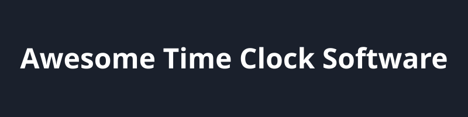

# Awesome-Time-Clock-Software 🚀

## 🏆 Top Time Clock Software Ecosystem

**Curated List of SaaS Products & Open-Source GitHub Projects** - Find the best SEO-optimized Time Clock software, employee tracking apps, and workforce management tools.

*Focused on Employee Time Tracking, Attendance, Clock-In/Out, GPS & Workforce Time Management*

**Last updated: August 2026**

This repository tracks notable **SaaS platforms** and **open-source projects** for **Time Clock Software**. These tools enable clock-in/out, timesheets, GPS/geofencing, attendance tracking, overtime calculation, payroll exports, and workforce time management for hourly, remote, and field teams.

**Examples** include Buddy Punch, Clockify, Jibble, QuickBooks Time, Connecteam, Homebase, Deputy, Hubstaff, TimeCamp, and ClockShark (the category leaders).

**Open-source emphasis**: This section is heavily expanded with every major active project for self-hosting, privacy-first tracking, team timesheets, and open attendance systems — ideal for businesses, freelancers, developers, and organizations seeking data ownership and customizable time tracking solutions.

Contributions welcome! Open a PR to add/update entries. Keep descriptions factual and link to official sites.

## Table of Contents

- [SaaS/Hosted Platforms](#saas-products)

- [Open-Source GitHub Projects](#open-source-github-projects)

- [How to Contribute](#how-to-contribute)

- [Disclaimer](#disclaimer)

## ☁️ SaaS/Hosted Platforms

| Product | Description | Pricing (Starting Tier) | Free Tier Limits | Company Size |
|---------|-------------|-------------------------|------------------|--------------|
| **[QuickBooks Time](https://quickbooks.intuit.com/time-tracking/)** | Time tracking tightly integrated with QuickBooks for payroll, GPS tracking, and job costing. | $20/mo base + $10/user/mo | 30-day free trial | ~$10B+ (Intuit) |
| **[Deputy](https://www.deputy.com/)** | Workforce management software combining advanced scheduling, time tracking, compliance, and labor cost control. | $5.00/user/mo (min $30 spend) | 31-day free trial | ~$1.1B Valuation |
| **[Connecteam](https://connecteam.com/)** | All-in-one workforce app with GPS time clock, geofencing, scheduling, and communication for deskless and field teams. | $29/mo (base for 30 users) | Free forever: Up to 10 users | ~$800M Valuation |
| **[Homebase](https://www.joinhomebase.com/)** | Scheduling and time clock platform popular with small businesses, restaurants, and retail, featuring free plans and payroll tools. | $20/location/mo | Free forever: 1 location, up to 20 employees | ~$500M Valuation |
| **[Clockify](https://clockify.me/)** | Popular free/unlimited time tracking platform for projects, teams, and freelancers with timesheets, reporting, and integrations. | $3.99/user/mo | Free forever: Up to 5 users | ~$50M Revenue |
| **[Hubstaff](https://hubstaff.com/)** | Time tracking with GPS, activity monitoring, screenshots, and productivity insights for remote and distributed teams. | $4.99/user/mo (min 2 seats) | Free forever: Strictly 1 user, max 3 clients | ~$50M Revenue |
| **[ClockShark](https://www.clockshark.com/)** | Job-based time tracking and scheduling designed for construction, field crews, and service businesses with GPS breadcrumbs. | $40/mo base + $8/user/mo | 14-day free trial | ~$30M Revenue |
| **[Jibble](https://www.jibble.io/)** | Free time clock app with face recognition, GPS, geofencing, and automatic timesheets suitable for unlimited users. | $3.99/user/mo | Free forever: Unlimited users | ~$20M Revenue |
| **[TimeCamp](https://www.timecamp.com/)** | Automatic and manual time tracking with project management, budgeting, and detailed reporting features. | $3.99/user/mo | Free forever: Unlimited users & projects | ~$15M Revenue |
| **[Buddy Punch](https://buddypunch.com/)** | Employee time clock with GPS, geofencing, facial recognition, kiosk mode, and strong anti-buddy-punching controls for accurate payroll. | $19/mo base + $4.49/user/mo | 14-day free trial | ~$10M Revenue |

## 💻 Open-Source GitHub Projects

- **[kimai](https://github.com/kimai/kimai)**   

  Mature, full-featured open-source time tracking platform for teams with projects, customers, invoicing, reports, permissions, and multi-user support.

- **[openproject](https://github.com/opf/openproject)**   

  Full project management suite with built-in time tracking and cost reporting.

- **[erpnext](https://github.com/frappe/erpnext)**   

  Free and open source enterprise resource planning (ERP) system that includes time tracking and timesheets.

- **[activitywatch](https://github.com/ActivityWatch/activitywatch)**   

  Privacy-focused, automatic open-source time tracker that monitors app/window usage locally with extensible watchers.

- **[super-productivity](https://github.com/johannesjo/super-productivity)**   

  Open-source productivity and time tracking app combining tasks, timers, Pomodoro, and issue-tracker integrations (GitHub, Jira, etc.).

- **[solidtime](https://github.com/solidtime-io/solidtime)**   

  Modern open-source time tracker for freelancers and agencies with projects, tasks, clients, billable rates, and multi-organization support.

- **[server](https://github.com/traggo/server)**   

  Self-hosted tag-based time tracking tool with customizable tags, dashboards, and full data ownership.

- **[minute](https://github.com/ktmouk/minute)**   

  Open-source personal time tracking app focused on reviewing and improving individual time usage with folders and categories.

- **[TeamBridge](https://github.com/Mecacerf/TeamBridge)**   

  Lightweight open-source attendance and work-hours tracker for small teams using simple spreadsheet-backed storage.

- **[Marathon](https://github.com/connervieira/Marathon)**   

  Transparent, self-hosted employee management and time clock tool with shift verification and open-source auditability.

- **[FSP.AttendanceClock](https://github.com/FSP-Labs/FSP.AttendanceClock)**   

  Clean self-hosted employee attendance clock built with ASP.NET Core and PostgreSQL for clock-in/out and hour reports.

### Additional Strong Open-Source Options

- **[Timewarrior](https://timewarrior.net/)** and other CLI trackers for terminal-centric workflows.

- Community **Anuko Time Tracker**, **Cattr**, and **eHour** style self-hosted timesheet systems.

- Many **barcode/kiosk attendance** scripts and **GPS-enabled** mobile open-source experiments.

- Automatic trackers such as **arbtt** and window-title based tools for personal analytics.

**Frameworks for building custom systems**: Combine **Kimai** or **solidtime** for core timesheets, **ActivityWatch** for automatic capture, **PostgreSQL** for storage, **Grafana** for dashboards, mobile progressive web apps for clock-in, and **Ollama**/local LLMs for intelligent timesheet suggestions, anomaly detection, and natural-language reports.

## 🤝 How to Contribute

1. Fork the repo.

2. Add/edit entries in `README.md` (follow existing format).

3. Include: name, link, 1–2 sentence description, and whether it's SaaS or open-source.

4. Submit PR with a short explanation.

Star the repo if you find it useful!

## ⚠️ Disclaimer

- This is a **community-curated** list — not exhaustive and not an endorsement.

- Time clock and attendance tools handle sensitive employee data and must comply with labor laws, privacy regulations (GDPR, CCPA, etc.), and payroll accuracy requirements.

- Self-hosted open-source solutions require proper security, access controls, audit logging, and reliable backups before production use.

---

**Made for HR teams, operations managers, freelancers, remote companies, and developers who value time data ownership.**

Let's make time tracking more open, accurate, and privacy-respecting.

## 📈 Star History

<a href="https://www.star-history.com/?repos=ishandutta2007/Awesome-Time-Clock-Software&type=date&legend=bottom-right">
<picture>
<source media="(prefers-color-scheme: dark)" srcset="https://api.star-history.com/chart?repos=ishandutta2007/Awesome-Time-Clock-Software&type=date&theme=dark&legend=bottom-right" />
<source media="(prefers-color-scheme: light)" srcset="https://api.star-history.com/chart?repos=ishandutta2007/Awesome-Time-Clock-Software&type=date&legend=bottom-right" />

</picture>
</a>

